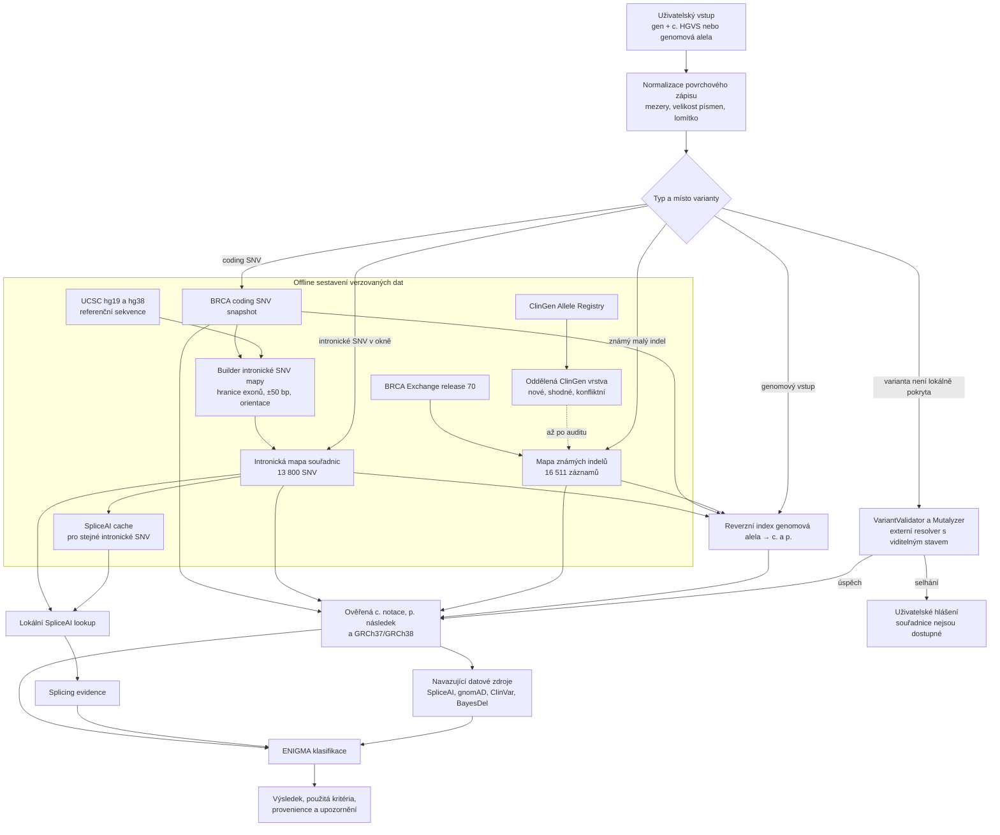

# Souřadnicové mapy, SNV a indely v ARIANE

## K čemu používáme intronickou mapu souřadnic

Soubor `data/coordinates/brca_intronic_snv_coordinates.json` převádí intronickou
c. notaci BRCA1/2 SNV na genomovou alelu v GRCh37 a GRCh38.

Například z obecného vstupu:

```text
BRCA1 c.548-9A>G
```

ARIANE získá pro každou sestavu chromozom, pozici, REF a ALT. Genomové souřadnice
potom potřebují další části aplikace, zejména:

- lokální nebo externí vyhledání SpliceAI,
- vyhledání populační frekvence,
- porovnání s ClinVar a dalšími externími zdroji,
- přijetí varianty zadané genomovou souřadnicí a její převod zpět na c. notaci,
- kontrola referenční báze intronického SNV.

Mapa umožňuje provést základní převod bez dostupnosti VariantValidatoru nebo
Mutalyzeru. Její výsledek je reprodukovatelný a nemění se mezi jednotlivými
požadavky.

V současné implementaci se verzovaná intronická mapa načítá před průběžnou
`coordinates_cache.json`, takže průběžná cache nemůže přepsat její stejné klíče.
Loader aplikace však zatím nekontroluje metadata a checksum intronické mapy.
Checksum kontrolují testy a validační příkaz builderu. Tuto kontrolu je vhodné
doplnit také při startu aplikace.

## Jak byla intronická mapa vytvořena

1. Z coding SNV snapshotu se pro BRCA1 a BRCA2 získaly souřadnice jednotlivých
   kódujících pozic.
2. Z přerušení souvislých genomových bloků se odvodily hranice exonů a orientace
   transkriptu.
3. Kolem každé vnitřní exonové hranice se vytvořilo okno 50 intronických bází.
4. Referenční genomové sekvence pro hg19 a hg38 byly získány z UCSC Genome
   Browser sequence API.
5. U BRCA1 na minus vlákně se genomové báze převádějí na komplementární báze
   transkriptového zápisu.
6. Pro každou pozici se vytvořily tři možné SNV, tedy změny na všechny jiné báze.
7. Builder ověřil, že referenční transkriptová báze je v GRCh37 a GRCh38 stejná.

Výsledkem je 4 600 intronických pozic a 13 800 možných SNV.

## Proč lze předpočítat SNV

Na jedné pozici existují pouze tři možné jednonukleotidové záměny. Jestliže máme
4 600 pozic, celý prostor obsahuje přesně:

```text
4 600 pozic × 3 alternativní báze = 13 800 SNV
```

Tento prostor je konečný, malý a lze jej celý vytvořit, zkontrolovat a uložit.

## Proč nelze stejně jednoduše předpočítat všechny indely

U indelů není na jedné pozici pouze několik možností. Mohou zahrnovat:

- deleci jedné nebo mnoha bází,
- různé začátky a konce delece,
- vložení sekvence libovolné délky a složení,
- duplikaci různě dlouhého úseku,
- kombinovanou změnu delins,
- změnu přes hranici exonu,
- komplexní nebo nejistě lokalizovanou změnu.

Počet možných delecí roste přibližně s druhou mocninou délky oblasti. Počet
možných insercí navíc roste exponenciálně s povolenou délkou vložené sekvence.
Pro libovolně dlouhou inserci není prostor konečný.

Proto nemá smysl vytvořit soubor všech teoreticky možných indelů stejným
způsobem jako u SNV.

## Co u indelů předpočítat můžeme

Máme tři praktické možnosti:

### 1. Mapa známých indelů

Uložíme indely přítomné v určených zdrojích, například BRCA Exchange, ClinGen
Allele Registry nebo ClinVar. Pro každý záznam uchováme kanonickou c. notaci,
p. následek, obě assembly, identifikátory a provenienci.

Výhoda je rychlý a reprodukovatelný lookup. Nevýhoda je, že mapa nikdy nebude
obsahovat každou možnou novou variantu.

### 2. Omezený teoretický prostor

Lze vygenerovat například všechny jednonukleotidové delece, všechny krátké
delece do zvolené délky nebo omezenou množinu duplikací v kódující sekvenci.

Takový soubor ale musí mít přesně deklarované hranice. Nesmí se vydávat za mapu
všech indelů a neřeší libovolné inserce ani komplexní změny.

### 3. Lokální výpočet na požádání

Pro variantu, která není ve známé mapě, lze použít lokální referenční sekvence,
anotaci exonů a transkriptový model. Sekvenčně orientovaný HGVS nástroj může:

1. ověřit odstraněnou nebo vloženou sekvenci,
2. normalizovat variantu podle HGVS pravidla 3',
3. převést změnu mezi transkriptem a GRCh37/GRCh38,
4. změnit CDS a přeložit proteinový následek,
5. vrátit jednoznačný výsledek nebo řízené selhání.

Toto je výpočetně možné pro malé přesně popsané indely. Nestačí k tomu ale
současná intronická SNV mapa. Potřebujeme lokální genomové sekvence, přesné
zarovnání referenčních transkriptů k oběma assembly a plnou sekvenční HGVS
normalizaci.

U exonových delecí, CNV, nejistých rozsahů a variant ovlivňujících splicing
nemusí být p. následek určitelný pouze z DNA zápisu. V takovém případě se má
vrátit `p.(?)` s vysvětlením, nikoli odhad.

## Doporučené řešení pro ARIANE

Krátkodobě:

1. Zachovat úplnou intronickou SNV mapu.
2. Zachovat současnou mapu známých indelů z BRCA Exchange.
3. Rozšířit známé indely o oddělenou a auditovanou vrstvu ClinGen.
4. Při konfliktu nevybrat první výsledek, ale vrátit ambiguous nebo záznam
   vyřadit z automatického použití.
5. Za běhu nepoužívat tichý odhad.

Dlouhodobě:

1. Připravit lokální referenční sekvence a transkriptová zarovnání.
2. Zavést lokální sekvenční normalizátor pro malé SNV a indely.
3. Známé mapy používat jako rychlý index a nezávislý kontrolní zdroj.
4. Nově vypočítané varianty nepřidávat automaticky do verzované mapy během
   uživatelského požadavku.
5. Aktualizace map provádět samostatným reprodukovatelným buildem s auditem,
   testy, metadaty a checksumem.

## Diagram datových cest



## Důležité rozlišení

```text
Intronická SNV mapa
  = úplný předpočítaný prostor tří záměn ve vymezených intronických pozicích

Mapa známých indelů
  = katalog indelů nalezených ve vybraných zdrojích

Runtime coordinate cache
  = průběžně uložené výsledky externích resolverů, nikoli referenční dataset

SpliceAI cache
  = předpočítané predikční skóre, které používá genomové souřadnice z mapy
```

Tyto soubory se nemají vzájemně přepisovat. Každý má jiný účel, původ dat,
rozsah a pravidla aktualizace.
