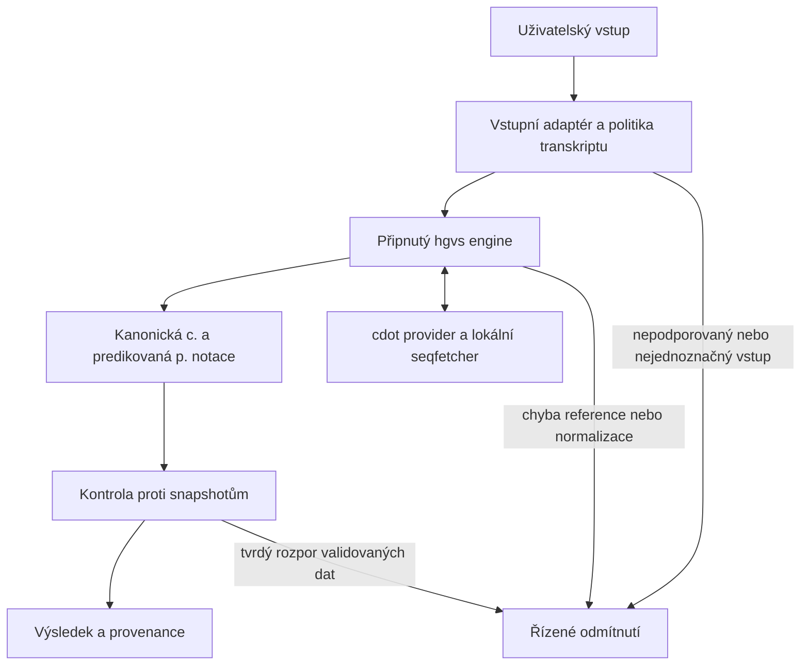

# Návrh lokálního doplňování proteinové notace

Stav dokumentu: architektonický návrh vrstvy A je implementován; vrstva B zůstává samostatná  
Datum: 2026-08-04

Implementovaná vrstva A používá `hgvs==1.5.7`, `cdot==0.2.30`, lokální
checksumovaný panelový referenční balík a úplné RefSeq transkriptové i proteinové
sekvence. Produkční popis skutečného runtime chování je v
[`implementation_and_data_sources.md`](implementation_and_data_sources.md).

Vrstva B zatím implementována obecně není. Genomické vstupy jsou omezeny na
jednoznačné záznamy v existujícím reverse indexu coding SNV a známých indelů.
Teprve získaná `c.` notace pokračuje do nové sekvenční vrstvy A. Podpora
genomického vstupu proto zatím není rozsahem ekvivalentní přímému `c.` vstupu.

## 1. Cíl

ARIANE má z jednoznačně popsané DNA varianty bezpečně určit:

1. přesný referenční transkript,
2. ověřenou a kanonickou `c.` notaci,
3. predikovaný přímý proteinový následek v třípísmenné HGVS notaci,
4. důvod, proč proteinový následek určit nelze,
5. zdroj a verzi všech referenčních dat použitých při výpočtu.

Výpočet nesmí záviset na dostupnosti externí služby během uživatelského
požadavku. Nejednoznačnost, nepodporovaný typ varianty, neshoda reference nebo
rozpor validovaných zdrojů musí skončit řízenou chybou nebo stavem `p.?`, nikoli
odhadem.

Proteinová notace odvozená pouze z DNA je predikovaný přímý následek na
referenčním transkriptu. Není to důkaz skutečného RNA ani proteinového produktu.
Toto rozlišení je důležité zejména u variant, které mohou ovlivnit splicing.

## 2. Proč změnit současné řešení

Současná implementace používá dvě hlavní lokální vrstvy:

- coding SNV snapshot s předpočítanými následky,
- snapshot 16 511 malých indelů převzatých z BRCA Exchange.

Toto řešení je reprodukovatelné a bezpečně odmítá neznámé případy. Neumí však
obecně ověřit a zpracovat nový přesně popsaný coding indel, pokud není přítomen
ve snapshotu. Různé ekvivalentní zápisy stejného indelu se musí ručně nebo při
offline buildu přidávat jako aliasy.

Úplné mRNA sekvence používaných transkriptů jsou přitom malé:

| Gen | Transkript | Délka |
| --- | --- | ---: |
| BRCA1 | `NM_007294.4` | 7 088 nt |
| BRCA2 | `NM_000059.4` | 11 954 nt |

Obě sekvence dohromady mají 19 042 nukleotidů. Jejich uložení není technický
problém. Chybějící částí není kapacita disku, ale spolehlivý parser, HGVS
normalizace, aplikace sekvenční změny, překlad CDS a formátování proteinového
následku.

## 3. Hlavní rozhodnutí

Architektura se rozdělí podle schopnosti, nikoli podle počtu genů:

| Vrstva | Vstup a výstup | Potřebná data | Vliv počtu genů |
| --- | --- | --- | --- |
| A | transkriptová `c.` notace na `p.` následek | transkriptová a proteinová sekvence, CDS hranice | malý, přidává se několik kB na transkript |
| B | genomová alela na `c.` notaci | exonová zarovnání a genomová sekvence | větší, ale stále jde o verzované soubory |

Většina současných požadavků ARIANE patří do vrstvy A. Tato vrstva nepotřebuje
PostgreSQL UTA ani plný SeqRepo. Přidání genu má být datová změna v manifestu,
nikoli změna normalizačního kódu.

Doporučené řešení:

1. Normalizační engine je připnutá verze Python balíku `hgvs`.
2. Engine komunikuje pouze přes rozhraní `hgvs.dataproviders.interface`.
3. Prvním providerem je lokální cdot `JSONDataProvider` nad připnutým oficiálním
   cdot release a lokálními panelovými FASTA soubory.
4. ARIANE si zachová tolerantní vstup pro mezery, velikost písmen a legacy
   aliasy. Biologickou HGVS normalizaci nebude implementovat podruhé.
5. Stávající snapshoty zůstanou zdrojem evidence, externích identifikátorů a
   nezávislé kontroly výsledku.
6. UTA je možný zaměnitelný provider, nikoli výchozí povinná služba.

### 3.1 Volba datového provideru

| Provider | Použití | Výhody | Nevýhody |
| --- | --- | --- | --- |
| checksumovaný panelový výřez oficiálního cdot release + panelová NCBI FASTA | implementované výchozí řešení vrstvy A | malé runtime nároky, stejné cdot schéma, bez databázové služby | builder musí kontrolovat zdrojový release a read-back přes cdot |
| plný oficiální cdot release + panelová NCBI FASTA | nevhodné pro současný runtime | bez filtrování | naměřeno přibližně 2,57 GB RAM na worker |
| UTA + SeqRepo | případy neřešitelné nebo neshodné v lehkém provideru | vyzrálá databáze zarovnání | PostgreSQL, větší data a složitější provoz |

Panelový výřez nevytváří vlastní schéma. Builder načte checksumovaný oficiální
release přes typed model cdot, vybere accession uvedené v manifestu, serializuje
je stejným modelem a výsledný soubor znovu načte přes `JSONDataProvider`.

cdot přímo poskytuje `JSONDataProvider` implementující provider pro biocommons
`hgvs`. Jeho JSON schéma obsahuje transkript, protein accession, CDS hranice,
exonová zarovnání a gap informace. Pro vrstvu A se k němu připojí lokální FASTA
s přesnými transkriptovými a proteinovými sekvencemi. Pro vrstvu B se přidá
lokální genomová FASTA pro podporované assembly.

cdot `FastaSeqFetcher` je určen hlavně pro získávání sekvencí z lokální genomové
FASTA. Přesná RefSeq mRNA se ale může od genomu lišit. Vrstva A proto potřebuje
malý panelový seqfetcher nad indexovanou NCBI transkriptovou FASTA. Stejným
jednoduchým rozhraním může zpřístupnit i proteinovou FASTA. Tato komponenta
pouze vrací úsek sekvence podle accession a souřadnic. Neprovádí HGVS
normalizaci ani biologickou interpretaci.

UTA se zavede pouze tehdy, když validační matice pro některý schválený
transkript prokáže, že cdot provider a dostupná zarovnání neumějí požadované
mapování provést správně a jednoznačně. Samotná existence gapped alignment je
důvod k povinnému testu, nikoli automatický důvod k nasazení UTA, protože cdot
rovněž podporuje gap informace.

### 3.2 Proč nepsat vlastní neomezený HGVS parser

Úplná HGVS normalizace musí řešit repetitivní sekvence, pravidlo 3', změnu typu
`ins` na `dup`, nejisté rozsahy, složené alely, intronické pozice, UTR, start a
stop kodon, exonové hranice a rozdíly mezi transkriptem a genomem. Vlastní
neomezený parser by byl obtížně ověřitelný.

ARIANE proto implementuje pouze vstupní adaptér, manifest schválených
transkriptů, politiku podporovaných variant a srozumitelné chybové stavy nad
enginem `hgvs`. Sekce 12.3 určuje akceptační testy požadovaného chování, nikoli
algoritmus, který má ARIANE znovu samostatně naprogramovat.

### 3.3 Provozní uspořádání

```text
ARIANE backend
  Python hgvs, připnutá verze
        |
        +--> cdot JSONDataProvider
                |
                +--> připnutý oficiální cdot release
                +--> transkriptová a proteinová FASTA
                +--> genomová FASTA pouze pro vrstvu B
```

Za běhu se nepoužívá cdot REST API, veřejná UTA ani vzdálené získávání sekvencí.
Backend při startu ověří verze, checksumy, dostupnost všech schválených
transkriptů a kontrolní variantu pro každý povolený gen.

Aktualizace enginu, cdot dat nebo FASTA je samostatná datová změna. Vyžaduje
validační report, regresní testy, schválení a možnost návratu k předchozí verzi.

## 4. Referenční balík

Referenční balík je verzovaný datový vstup normalizačního enginu. Transkriptové
modely používají schéma cdot. ARIANE k nim přidává pouze panelový manifest,
sekvence, checksumy a údaje potřebné pro audit. Nevzniká druhý vlastní formát
transkriptových a exonových modelů.

Navrhovaný adresář:

```text
data/reference/panel/
  panel_manifest.json
  cdot/
    cdot-<release>.refseq.GRCh37.json.gz
    cdot-<release>.refseq.GRCh38.json.gz
  fasta/
    transcripts.fa
    proteins.fa
    transcripts.fa.fai
    proteins.fa.fai
  metadata.json
```

Jeden řádek panelového manifestu popisuje jeden schválený gen a obsahuje:

- gen,
- přesný RefSeq transcript accession včetně verze,
- přesný RefSeq protein accession včetně verze,
- zdroj výběru transkriptu, například ENIGMA, jiný VCEP nebo MANE,
- povolené schopnosti `c_to_p` a případně `g_to_c`,
- podporované genomové sestavy,
- verzi referenčního balíku.

Příklad struktury záznamu:

```json
{
  "gene": "BRCA1",
  "transcript": "NM_007294.4",
  "protein": "NP_009225.1",
  "transcript_selection_source": "ENIGMA BRCA1/2 VCEP",
  "capabilities": ["c_to_p", "g_to_c"],
  "assemblies": ["GRCh37", "GRCh38"]
}
```

cdot data obsahují identifikátory, hranice CDS a exonová zarovnání. FASTA část
obsahuje úplné mRNA a proteinové sekvence. Proteinová FASTA se musí získat
přímo z přesného verzovaného NCBI proteinového záznamu. Nesmí být vytvořena
překladem uložené mRNA, protože kontrola překladu CDS by pak porovnávala výpočet
s jeho vlastním výstupem. Metadata obsahují zdrojové URL, datum získání, verzi
přípravného skriptu a SHA-256 všech souborů. Konkrétní CDS souřadnice se
nesmí opsat ručně. Přípravný proces je převezme z oficiálního cdot release a
ověří, že překlad CDS odpovídá samostatně získané NCBI proteinové sekvenci.

ARIANE nesmí vytvářet cdot záznamy vlastním zapisovačem. První verze použije
celý oficiální lokální cdot release. Filtrování se zavede jen jako pozdější
optimalizace doložená měřením. Případný výřez musí zachovat celé záznamy beze
změny a musí jej načíst a ověřit stejná připnutá verze `JSONDataProvider`, která
se použije za běhu. Metadata uchovají identifikaci a checksum původního release
i případného výřezu.

Přidání genu je datová změna: přidá se řádek manifestu a sekvence a spustí se
kontrola přítomnosti transkriptu v připnutém cdot release a validační matice.
Aplikační kód se kvůli novému genu nemění.

### 4.1 Genomová vrstva

Pro výpočet `p.` následku z coding `c.` notace stačí transkriptová sekvence,
proteinová kontrolní sekvence a CDS anotace. Pro obecné přijímání genomových
variant a intronů je navíc potřeba:

- lokální genomová FASTA pro podporovanou sestavu,
- accession chromozomů včetně verze,
- cdot exonové zarovnání transkriptu na podporované assembly,
- orientace genu,
- informace o mezerách a neshodách mezi genomem a transkriptem.

Tato vrstva má být samostatná. První verze výpočtu `p.` následku nemusí čekat na
její dokončení, pokud přijímá pouze referenční transkriptovou `c.` notaci.
Každý schválený transkript se před povolením `g_to_c` otestuje na GRCh37 a
GRCh38, včetně zarovnávacích mezer. UTA se zvažuje pouze tehdy, pokud cdot
provider konkrétní potřebné mapování nedokáže reprezentovat nebo validace ukáže
nesprávný výsledek.

## 5. Politika transkriptů

ARIANE musí vždy vědět, ke kterému transkriptu se `c.` souřadnice vztahuje.

### 5.1 Explicitní accession

Podporované jsou pouze přesné verze:

```text
BRCA1  NM_007294.4
BRCA2  NM_000059.4
```

Jiná verze, accession bez verze, `NM_007300.x` nebo LRG se nesmí tiše převést.
Pokud pro ně později vznikne validovaná převodní mapa, bude tato mapa samostatný
verzovaný datový zdroj.

### 5.2 Holá `c.` notace

Holý vstup `BRCA1 c.303T>G` může zůstat podporovaný, protože aplikace je výslovně
vázaná na ENIGMA referenční transkript. Výstup ale musí viditelně uvést:

```text
No transcript was supplied. ARIANE interpreted this variant as
NM_007294.4:c.303T>G.
```

Tato informace má být ve veřejném výsledku, nikoli pouze v JSONu nebo v
rozbalovacím technickém detailu.

## 6. Rozsah automatického výpočtu

První verze má podporovat pouze jednu přesnou sekvenční změnu. Úplný výpočet
změněné proteinové sekvence je omezen na CDS; pro vybrané UTR a splice vstupy
jsou níže určeny konzervativní výstupní stavy:

| Typ vstupu | Příklad | První verze |
| --- | --- | --- |
| SNV | `c.303T>G` | ano |
| jednonukleotidová delece | `c.2102del` | ano |
| delece rozsahu | `c.68_69del` | ano |
| delece s uvedenou sekvencí | `c.68_69delAG` | ano, po ověření `AG` |
| duplikace | `c.5266dup` | ano |
| duplikace s uvedenou sekvencí | `c.5266dupC` | ano, po ověření `C` |
| přesná inserce | `c.5551_5552insT` | ano |
| přesný delins | `c.123_125delinsAC` | ano |
| intronická varianta | `c.548-9A>G` | bez výpočtu proteinové sekvence, `p.?` |
| kanonický splice site | `c.8953+2T>C` | bez výpočtu proteinové sekvence, `p.?` |
| 5' UTR SNV | `c.-19G>A` | `p.?` v první verzi; automatický výpočet start-gain není podporován |
| 3' UTR SNV | `c.*135A>G` | ověřit výstup enginu a explicitně jej namapovat; nepředpokládat předem `p.(=)` |
| nejistý rozsah | `c.(...)_(...)del` | ne |
| exonová delece nebo duplikace | exon 10 deletion | ne bez RNA nebo přesných breakpointů |
| dvě změny v cis | `c.[...;...]` | ne v první verzi |
| samotná `p.` notace | `p.(Lys701fs)` | ne, neurčuje DNA alelu |

Zvláštní skupiny se mají přidávat až po samostatném návrhu a regresních testech:

- iniciační kodon,
- stop-loss a proteinová extenze,
- varianty přes hranici CDS,
- UTR indely,
- složené alely,
- přesně popsané exonové nebo strukturální změny.

## 7. Normalizační a výpočetní pipeline



### 7.1 Povrchová normalizace

Tato fáze smí opravovat pouze zápis, nikoli biologický význam:

- velikost písmen,
- nadbytečné mezery a tabulátory,
- prefixy `NM`, `c.` a `p.`,
- oddělovač mezi `c.` a `p.`,
- `Ter` a `*` na proteinové úrovni.

### 7.2 Hranice odpovědnosti

ARIANE odpovídá za povrchovou normalizaci vstupu, výběr schváleného transkriptu,
omezení podporovaného rozsahu, mapování chyb a audit. Parser biologické HGVS
změny, kontrolu reference, pravidlo 3', aplikaci změny a odvození proteinového
následku poskytuje připnutý engine. Požadované chování těchto operací je popsáno
jako akceptační testy v sekci 12.3.

## 8. Splicing a RNA evidence

DNA sekvence umožňuje vypočítat přímý následek změny na předpokládané mRNA.
Neumožňuje určit skutečný transkript u varianty, která mění splicing.

Pravidla výstupu:

1. Čistě intronická nebo splice-site varianta bez RNA výsledku dostane `p.?`.
2. U coding varianty se vypočítaný přímý sekvenční následek uchová odděleně.
   Pokud explicitní splice pravidlo nebo umístění na splice-senzitivní pozici
   znamená, že skutečný transkript nelze spolehlivě předpovědět, veřejná
   proteinová notace je `p.?`, zatímco přímý následek zůstane v technickém
   detailu.
3. Přímý `p.(...)` následek lze použít jako veřejnou notaci jen tehdy, když
   definovaná pravidla nevyžadují neznámý splice následek. Nestačí obecný dojem,
   že coding změna pravděpodobně neovlivní RNA.
4. SpliceAI nemění vypočítaný přímý proteinový následek na experimentální RNA
   následek.
5. Table 9 nebo jiný kurátorovaný RNA zdroj může dodat konkrétní následek pouze
   tehdy, pokud jej zdroj skutečně uvádí a mechanismus je jednoznačný.
6. NMD je interpretační vlastnost pro PVS1. Nemění samotný HGVS popis
   předpokládané změněné proteinové sekvence.

Stav `p.?` musí nahradit současný kanonický výstup `p.(?)`. Aktuální HGVS používá
`p.?` pro očekávaný, ale nespolehlivě předvídatelný proteinový následek. Během
migrace lze na vstupu přijímat obě formy, ale výstup má být jednotný.

## 9. Role současných snapshotů

Referenční výpočet a kurátorované snapshoty mají odlišné úlohy.

### 9.1 Referenční výpočet

Odpovídá na otázky:

- je vstupní sekvence v souladu s referencí,
- jaká je kanonická reprezentace změny,
- jaký je predikovaný přímý proteinový následek.

### 9.2 Snapshot známých indelů

Odpovídá na otázky:

- byla alela přítomna v BRCA Exchange nebo jiném zdroji,
- jaké má známé GRCh37 a GRCh38 reprezentace,
- jaké má externí identifikátory,
- zda nezávislý zdroj uvádí stejný proteinový následek.

Proteinová notace ze snapshotu se před porovnáním nesmí použít jako surový
řetězec. Musí projít stejným kanonickým proteinovým formátovačem jako nově
vypočtený následek. Formátovač sjednotí třípísmenné a jednopísmenné
aminokyselinové kódy, závorky predikce, `Ter` a `*`, legacy frameshift zápisy a
synonymní zápisy. Historické `X` se nesmí slepě převést na `Ter`, protože v
současné nomenklatuře označuje neznámou aminokyselinu. Jeho převod musí být
zdrojově specifický a auditovaný.

### 9.3 Pravidlo konfliktu

Pokud lokální sekvenční výpočet a validovaný snapshot nesouhlasí v identitě
alely nebo v proteinovém následku, ARIANE nesmí vybrat jednu hodnotu podle
priority. Varianta musí skončit ve stavu datového konfliktu a nesmí být
automaticky klasifikována, dokud není konflikt vysvětlen.

### 9.4 Kurátorovaná vrstva vyřešených konfliktů

Známý a odborně vyřešený konflikt se nemusí opakovaně blokovat. Smí být uložen
v samostatném verzovaném souboru s validovaným schématem, například:

```text
data/curation/normalization_conflict_resolutions.json
data/curation/normalization_conflict_resolutions.metadata.json
```

Každé rozhodnutí musí obsahovat:

- jednoznačnou identitu alely a referenční transkript,
- všechny konfliktní hodnoty,
- typ konfliktu,
- přijaté technické nebo biologické vysvětlení,
- výslednou hodnotu a přesný rozsah její platnosti,
- primární zdroje,
- jméno nebo stabilní identifikátor kurátora,
- odbornou roli kurátora a druhého kontrolujícího,
- datum rozhodnutí a datum poslední revize,
- verzi referenčního balíku a dotčených snapshotů,
- odkaz na issue, protokol nebo jiný auditní záznam.

Runtime tuto vrstvu pouze čte. Nesmí do ní zapisovat ani vytvořit nové rozhodnutí
z uživatelského požadavku. Neznámý konflikt zůstává fail-closed.

Technický konflikt zápisu nebo normalizace může po doložené kontrole vyřešit
správce dat a druhý vědecký reviewer. Konflikt skutečného RNA nebo proteinového
následku vyžaduje odborníka oprávněného rozhodovat biologickou interpretaci.
Konflikt klinické klasifikace se v normalizační vrstvě neřeší vůbec.

## 10. Výstup a audit

Normalizační odpověď má obsahovat minimálně:

```json
{
  "submitted_notation": "c.5266dupC",
  "assumed_transcript": true,
  "reference_transcript": "NM_007294.4",
  "canonical_c_notation": "c.5266dup",
  "canonical_p_notation": "p.(Gln1756ProfsTer74)",
  "direct_sequence_p_notation": "p.(Gln1756ProfsTer74)",
  "consequence_status": "predicted_direct_sequence_consequence",
  "normalization_engine": "biocommons.hgvs",
  "normalization_engine_version": "...",
  "provider_library": "cdot",
  "provider_library_version": "...",
  "cdot_data_release": "...",
  "cdot_data_sha256": "...",
  "sequence_bundle_version": "...",
  "sequence_bundle_sha256": "...",
  "cross_checks": [
    {
      "source": "BRCA Exchange release 70",
      "status": "match"
    }
  ],
  "warnings": []
}
```

Uživatel nemá v hlavním výsledku vidět technický JSON. Má vidět stručně:

```text
Interpreted as NM_007294.4:c.5266dup p.(Gln1756ProfsTer74)
Protein consequence predicted from the local reference transcript sequence.
```

Rozbalovací detail zobrazí verzi sekvence, checksum, metodu normalizace a
výsledky nezávislých kontrol.

Pole `consequence_status` má uzavřený výčet:

| Hodnota | Význam |
| --- | --- |
| `predicted_direct_sequence_consequence` | přímý následek vypočtený z referenční sekvence |
| `predicted_no_protein_sequence_change` | očekává se `p.(=)` |
| `protein_consequence_unknown` | používá se `p.?` |
| `curated_rna_supported_consequence` | následek pochází z auditovaného RNA zdroje |
| `resolved_reference_conflict` | použito schválené kurátorské rozhodnutí |

Synonymní varianta, například `p.(Gln1395=)`, používá stav
`predicted_no_protein_sequence_change`. Stav
`predicted_direct_sequence_consequence` se používá pouze tehdy, když přímý
výpočet předpovídá změněnou proteinovou sekvenci.

Chybné, nejednoznačné a nepodporované vstupy se nemají maskovat stavem z tohoto
výčtu. Vrátí strukturovanou chybu z následující sekce.

## 11. Chybové stavy

Chyby musí být strukturované a rozlišitelné:

| Kód | Význam |
| --- | --- |
| `unsupported_transcript` | accession nebo verze nejsou podporovány |
| `reference_mismatch` | uvedená REF nebo odstraněná sekvence nesedí |
| `unsupported_variant_type` | typ není v deklarovaném rozsahu |
| `uncertain_coordinates` | rozsah není přesně určen |
| `outside_supported_region` | změna neleží v podporované části CDS |
| `normalization_ambiguous` | existuje více biologicky různých interpretací |
| `validated_source_conflict` | lokální výpočet je v rozporu se snapshotem |
| `normalization_engine_unavailable` | připnutý normalizační engine nelze načíst |
| `transcript_annotation_unavailable` | chybí schválený cdot transkriptový model |
| `sequence_data_unavailable` | chybí potřebná mRNA, proteinová nebo genomová sekvence |
| `genomic_alignment_unavailable` | pro požadovanou sestavu chybí ověřené zarovnání |
| `reference_data_checksum_mismatch` | referenční balík je neúplný nebo poškozený |

Chybové hlášení nesmí obsahovat celou absolutní cestu serveru.

## 12. Validace a testování

### 12.1 Kontrola referenčního balíku

Při přípravě datového balíku i startu aplikace se ověří:

1. accession a verze,
2. délka sekvence,
3. SHA-256,
4. rozsah CDS,
5. překlad CDS proti RefSeq proteinové sekvenci,
6. že v referenční CDS není interní stop kodon,
7. že poslední kodon referenční CDS je platný stop kodon,
8. metadata a jejich checksum.

Chyba musí zabránit spuštění klasifikační části aplikace.

### 12.2 Jednotkové testy

Krátké umělé transkripty s homopolymery, tandemy, CDS a 3' UTR se zpřístupní
enginu přes testovací implementaci veřejného provider rozhraní. Produkční cdot
provider se kvůli testům neupravuje. Samostatný integrační test načte skutečný
cdot `JSONDataProvider` a panelové FASTA soubory. Otestuje se:

- kontrola REF,
- delece a duplikace s uvedenou a neuvedenou sekvencí,
- 3' posun v homopolymeru a tandemu,
- převod inserce na duplikaci,
- redukce `delins` po odstranění nezměněných okrajů,
- missense, nonsense a synonymní následek,
- frameshift včetně prvního skutečně změněného zbytku,
- `fsTer2`, okamžitý nonsense a výstup `fsTer?` při chybějícím novém stop kodonu,
- in-frame del, dup, ins a delins,
- idempotence `normalize(normalize(x)) == normalize(x)` pro všechny podporované
  typy vstupu.

### 12.3 Akceptační chování normalizačního enginu

Následující body popisují pozorovatelné výsledky testů. Nejsou zadáním k
vytvoření vlastního parseru, normalizátoru ani translátoru v ARIANE.

#### 12.3.1 Interpretace sekvenční změny

Engine musí přijmout všechny deklarované typy z tabulky v sekci 6 a odmítnout
nepodporovaný nebo nejednoznačný zápis. Vložení musí být vyhodnoceno mezi dvěma
sousedními pozicemi a rozsah musí být vzestupný a v podporované oblasti.

#### 12.3.2 Ověření reference

Engine musí přijmout `c.68_69delAG`, pokud reference obsahuje `AG`, a odmítnout
`c.68_69delCT` s kódem `reference_mismatch`. Zápis bez uvedené odstraňované nebo
duplikované sekvence smí přijmout pouze tehdy, když ji lze jednoznačně přečíst z
přesné referenční sekvence.

#### 12.3.3 HGVS normalizace

Engine musí aplikovat HGVS pravidlo 3' na přesném referenčním transkriptu,
rozlišit `dup` od `ins` a vrátit minimální kanonickou reprezentaci `delins`.
Testy musí pokrýt homopolymer, tandem, společné okraje REF a ALT a transkript
genu na genomovém minus vlákně. Druhá normalizační knihovna se do runtime ani
produkční pipeline nepřidává. Neshoda s nezávislým validátorem je validační
nález podle sekce 12.5.

#### 12.3.4 Frameshift a translace

Engine musí u frameshiftu a stop-loss pokračovat od iniciačního kodonu po mRNA
až k prvnímu novému stop kodonu, i když leží za původním koncem CDS. Pokud do
konce mRNA nový stop nenajde, musí být výstup bezpečně namapován na `fsTer?`.
Referenční překlad musí odpovídat samostatně získané NCBI proteinové sekvenci.

#### 12.3.5 Proteinový výsledek

Testy musí ověřit synonymní, missense, nonsense, frameshift, in-frame deleci,
duplikaci, inserci a delins. U frameshiftu se kontroluje první skutečně změněný
aminokyselinový zbytek a vzdálenost k prvnímu stop kodonu. Okamžitý stop se musí
popsat jako nonsense, nikoli `fsTer1`. Neznámý následek se mapuje na `p.?`.

### 12.4 Regresní korpus BRCA

Povinné jsou známé a tutorialové varianty, zejména:

```text
BRCA1 NM_007294.4:c.68_69del
BRCA1 NM_007294.4:c.3668_3671dup
BRCA1 NM_007294.4:c.5266dup
BRCA1 NM_007294.4:c.5551_5552insT
BRCA1 NM_007294.4:c.4185G>A
BRCA1 NM_007294.4:c.303T>G
BRCA2 NM_000059.4:c.5946del
BRCA2 NM_000059.4:c.9097del
```

Historické názvy `185delAG`, `5382insC` a `6174delT` mají být testovány jako
výslovně označené legacy aliasy. Nesmějí se interpretovat jako moderní holá
`c.` notace.

### 12.5 Nezávislá diferenciální validace

Validační úloha vytvoří sadu podporovaných SNV a indelů a porovná výsledky
alespoň s:

- VariantValidator,
- Mutalyzer,
- kurátorovanými HGVS příklady a přímými kontrolami překladu referenční
  sekvence.

Python `hgvs` a cdot provider jsou součástí testovaného enginu, proto se
nepočítají jako nezávislý validátor vlastního výsledku.

Externí služby nejsou runtime zdroj pravdy. Výsledky se uloží jako verzované
testovací fixture včetně data, verze nástroje a jeho referenčních dat.

Síťová kontrola má běžet plánovaně nebo při přípravě nového referenčního balíku,
nikoli jako povinná součást každého offline testu.

### 12.6 Audit verzí referenčního transkriptu

Auditní úloha musí získat také bezprostředně předchozí používanou verzi
transkriptu, zejména `NM_007294.3`, a porovnat ji s `NM_007294.4`. Audit uloží:

- délku a SHA-256 obou mRNA sekvencí,
- CDS souřadnice a SHA-256 CDS,
- protein accession, sekvenci a SHA-256,
- úplný seznam rozdílů před CDS, v CDS a za CDS,
- zda jsou `c.` souřadnice a reference v celé CDS skutečně kompatibilní,
- verzi a datum zdrojových NCBI záznamů.

Shoda souřadnic se nesmí předpokládat z názvu ani z dosavadní laboratorní praxe.
Výsledek auditu je verzovaný datový artefakt. Sám o sobě neopravňuje runtime k
tichému přijetí starší verze transkriptu.

### 12.7 Kritérium přijetí

Nový runtime výpočet lze zapnout pouze tehdy, pokud:

1. všechny existující podporované varianty zachovají očekávaný kanonický
   výsledek nebo je rozdíl jednotlivě vysvětlen změnou na správnější HGVS,
2. v deklarovaném podporovaném rozsahu není nevysvětlený rozdíl proti
   nezávislému validátoru,
3. všechny konflikty jsou součástí auditního reportu,
4. chybějící nebo poškozený referenční balík vede k fail-closed chování.

## 13. Migrační plán

### Fáze 1: panelový referenční balík

1. Připnout verze Python `hgvs` a cdot.
2. Stáhnout, připnout a kontrolovat checksum celého oficiálního cdot release.
   V první verzi nevytvářet panelový výřez.
3. Vytvořit panelový manifest pro BRCA1 a BRCA2.
4. Získat přesné NCBI transkriptové a proteinové FASTA, vytvořit jejich indexy,
   metadata a checksumy a přidat test překladu referenční CDS.
5. Vygenerovat audit rozdílů `NM_007294.3` proti `NM_007294.4` a odpovídající
   audit pro BRCA2 při každé změně podporované verze.
6. Ověřit, že vrstva `c_to_p` funguje bez genomové FASTA, UTA, SeqRepo a sítě.
7. Změřit velikost dat, paměť, výkon a dobu startu.
8. Neměnit současnou klasifikaci.

### Fáze 2: experimentální adaptér standardního normalizátoru

1. Implementovat jednotné interní rozhraní normalizačního enginu.
2. Napojit připnutý lokální `hgvs` na cdot `JSONDataProvider` a lokální FASTA.
3. Zachovat tolerantní povrchový parser ARIANE před standardním enginem.
4. Deklarovat podporované typy a mapovat chyby enginu na srozumitelné stavové
   kódy ARIANE.
5. Výsledky pouze porovnávat se současnými snapshoty a regresními fixtures.
   Manifest v této fázi ověřuje výběr transkriptu a dostupnost dat, nikoli
   proteinový následek.

### Fáze 3: audit rozdílů

1. Spustit nový normalizátor nad celým coding SNV snapshotem.
2. Spustit jej nad všemi použitelnými coding indely ve snapshotu.
3. Rozdělit rozdíly na chybu vstupu, rozdíl HGVS reprezentace, rozdíl
   transkriptu, chybu snapshotu a chybu nového výpočtu.
4. Nevysvětlené rozdíly nepropustit do produkce.

### Fáze 4: zapnutí pro přesně podporované varianty

1. Lokální výpočet se stane primární normalizační cestou pro deklarovaný rozsah.
2. Snapshot zůstane nezávislou kontrolou a zdrojem externích identifikátorů.
3. Neznámý coding indel již nebude odmítnut jen proto, že není v BRCA Exchange.
4. Nepodporované typy budou nadále fail-closed.

### Fáze 5a: další geny pro `c_to_p`

1. Pro každý gen přidat schválený transkript, protein a zdroj výběru do
   manifestu.
2. Přidat cdot transkriptový model a mRNA a proteinovou sekvenci.
3. Přidat genově specifické ENIGMA nebo jiné VCEP datové tabulky odděleně od
   obecné HGVS normalizace.
4. Pro každý nový gen spustit referenční, regresní a diferenciální validační
   matici před jeho povolením v produkci.
5. Neprovádět kvůli přidání genu změnu normalizačního aplikačního kódu.

### Fáze 5b: genomové vstupy `g_to_c`

1. Přidat lokální genomovou FASTA a cdot zarovnání pro podporované assembly.
2. Otestovat každý schválený transkript na mezerách a neshodách v zarovnání.
3. Normalizovat levě zarovnané VCF alely na transkriptovou HGVS reprezentaci.
4. Porovnat výsledky s nezávislými validátory a kurátorovanými příklady.
5. Zavést UTA provider pouze pro konkrétní panelové případy, u kterých cdot
   prokazatelně nestačí. Provider rozhraní se tím nesmí změnit.

## 14. Doporučené rozdělení kódu

```text
backend/reference_bundle.py
  načtení panelového manifestu, sekvencí, metadat a checksumů

backend/modules/hgvs_engine.py
  jednotné rozhraní nad připnutým lokálním hgvs a zaměnitelným providerem

backend/modules/hgvs_provider.py
  vytvoření cdot JSONDataProvider a propojení sekvenčních providerů

backend/modules/panel_seqfetcher.py
  čtení přesných NCBI transkriptových a proteinových FASTA podle accession

backend/modules/hgvs_input_adapter.py
  tolerantní povrchová normalizace a převod chyb na stavy ARIANE

backend/modules/hgvs_engine_health.py
  kontrola verzí, lokální dostupnosti a zákazu síťového fallbacku

backend/modules/variant_input.py
  orchestrace vstupu a politika transkriptů

scripts/prepare_panel_reference_bundle.py
  stažení a kontrola cdot release a samostatně získaných NCBI FASTA

scripts/validate_consequence_engine.py
  porovnání se snapshoty a externími validátory

data/reference/panel/
  manifest, cdot JSON, FASTA, metadata a checksumy

data/curation/normalization_conflict_resolutions.json
  auditovaná a schválená řešení známých normalizačních konfliktů
```

Klasifikátor nesmí obsahovat vlastní paralelní logiku pro odvozování `p.`
následku. Všechny vstupní cesty, web, API i batch, musí používat stejný
normalizační modul.

## 15. Doporučení

Protože se ARIANE má rozšiřovat na další geny, doporučeným produkčním základem je
připnutý lokální `hgvs` se zaměnitelným providerem. Výchozí provider používá
celý připnutý oficiální cdot release a lokální panelovou FASTA. ARIANE nad ním poskytne vlastní
politiku transkriptů, tolerantní uživatelský vstup, audit, fail-closed chování a
srozumitelná vysvětlení. Nebude vytvářet druhý obecný biologický normalizátor.

Rozšíření `c_to_p` na další gen je primárně datová změna v manifestu, cdot JSON a
FASTA. Genomová vrstva `g_to_c` se přidává odděleně. UTA a SeqRepo nejsou
výchozí podmínkou růstu panelu. UTA se zavede pouze při doložené potřebě
konkrétního genomového mapování, které lehký provider nezvládne správně.

Stávající snapshoty se nemají odstranit. Mají změnit roli z jediného zdroje
proteinového následku na nezávislou kontrolní a provenienční vrstvu.

Před nasazením se musí na cílovém Ubuntu serveru otestovat úplně offline režim.
Panelový výřez cdot dat se začne řešit až tehdy, když měření ukáže problém s
velikostí nebo dobou startu. Nemění rozhraní enginu ani onboarding genu.

## 16. Primární technické zdroje

- HGVS general recommendations: https://hgvs-nomenclature.org/stable/recommendations/general/
- HGVS uncertain consequences: https://hgvs-nomenclature.org/stable/recommendations/uncertain/
- HGVS protein frameshift: https://hgvs-nomenclature.org/stable/recommendations/protein/frameshift/
- Python `hgvs`: https://hgvs.readthedocs.io/en/stable/
- cdot: https://github.com/SACGF/cdot
- UTA: https://github.com/biocommons/uta
- Mutalyzer: https://mutalyzer.readthedocs.io/en/latest/
- NCBI BRCA1 transcript: https://www.ncbi.nlm.nih.gov/nuccore/NM_007294.4
- NCBI BRCA2 transcript: https://www.ncbi.nlm.nih.gov/nuccore/NM_000059.4
